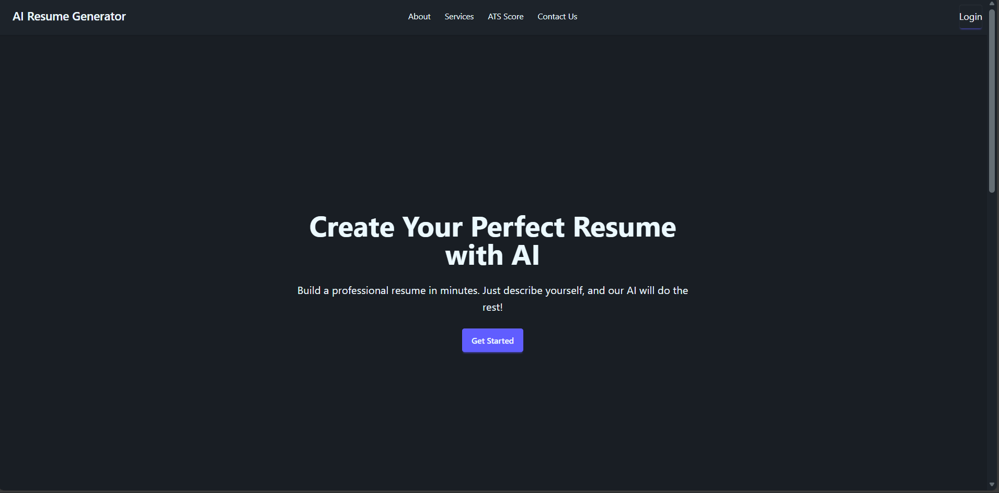
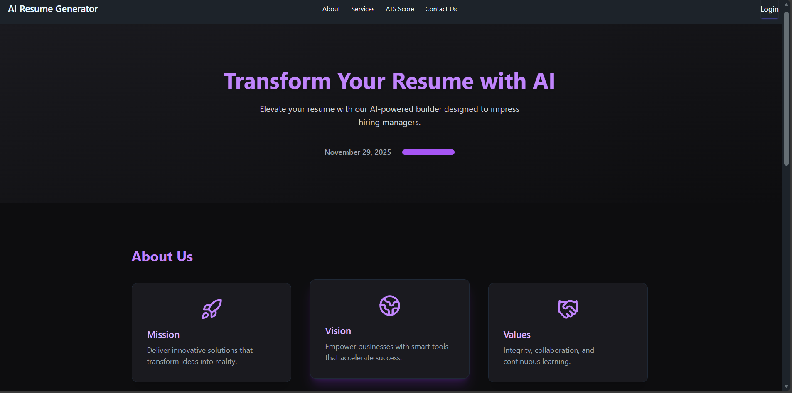
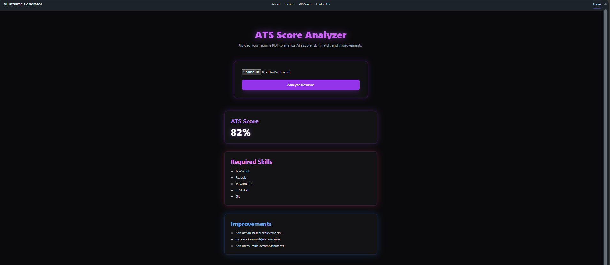
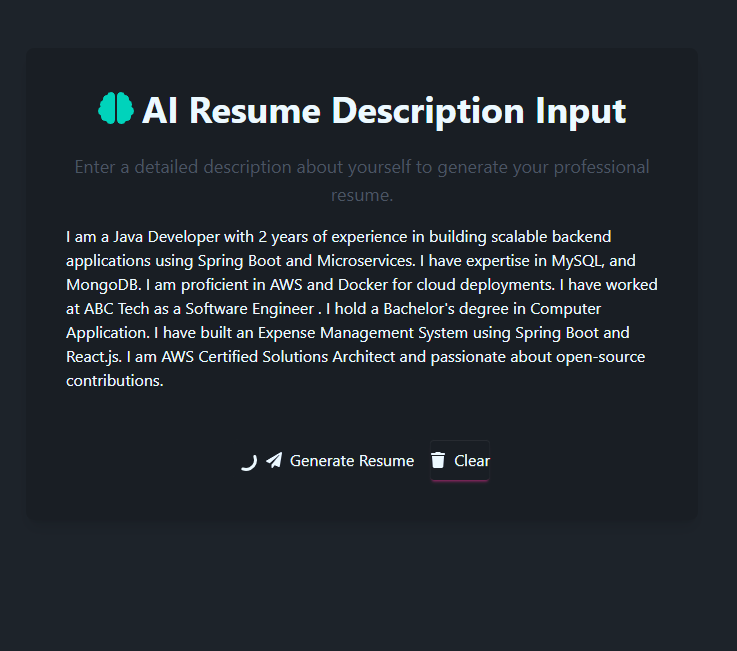
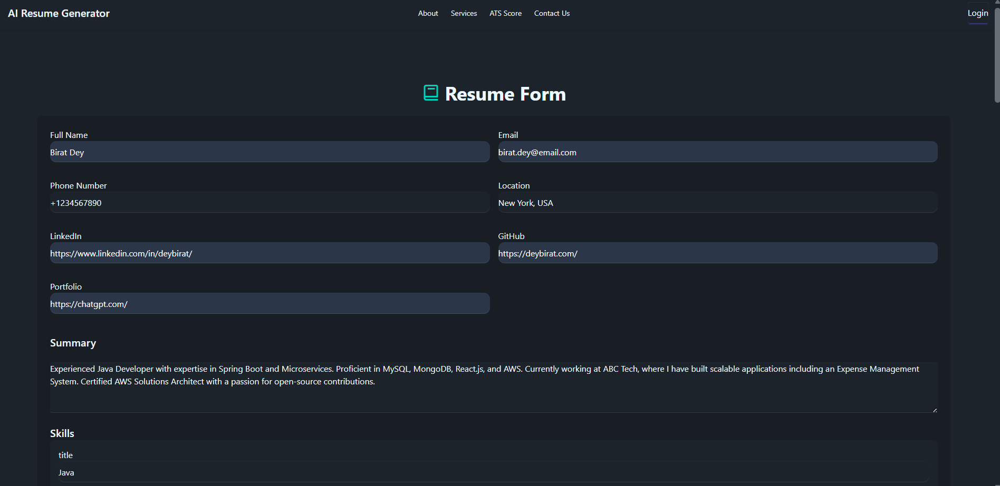
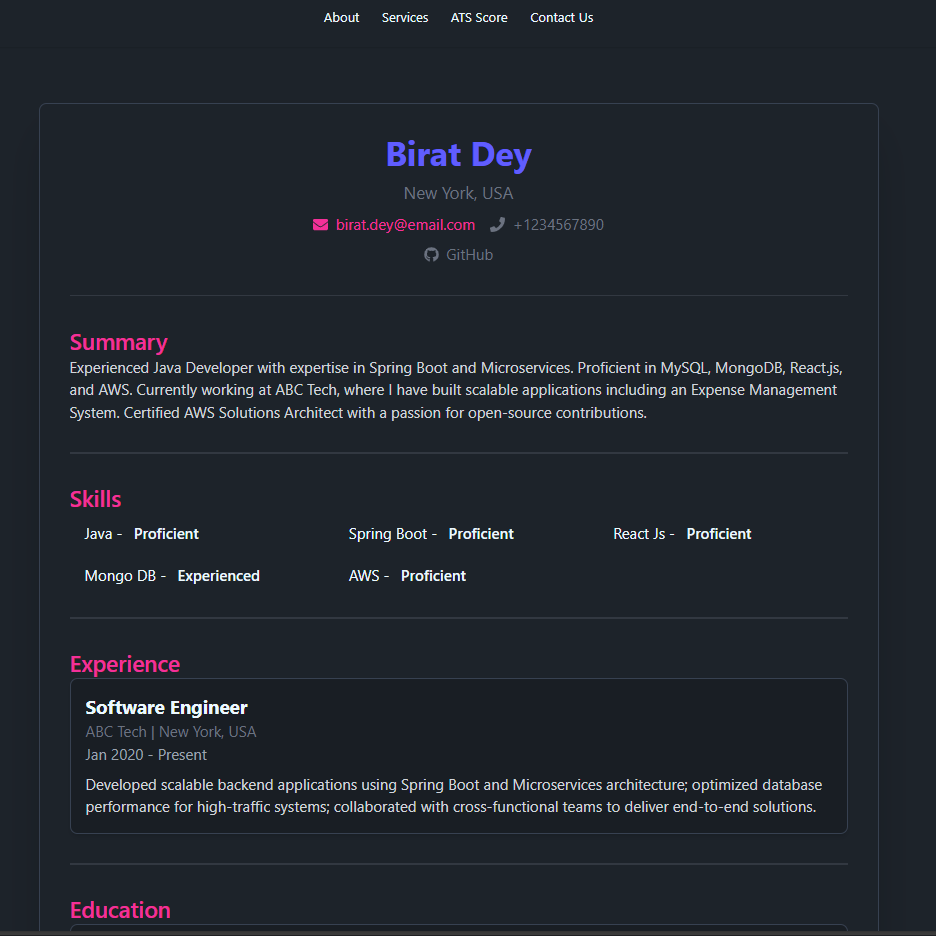

# 🚀 AI Resume Generator

An intelligent, end-to-end AI-powered Resume Generator and ATS Analyzer built using Spring Boot (Spring AI) + Ollama + ChatGPT/DeepSeek APIs on the backend and ReactJS + TailwindCSS + DaisyUI on the frontend.

This project transforms a simple user prompt into a fully structured JSON-based resume format, allowing users to edit, preview, and download their resumes.

---

## ✨ Features

### 🧠 AI Resume Generation Engine
<p align="center">   </p>

```Diff
+ Describe yourself in natural language
+ AI transforms input into a professional resume
+ Generates:
    → Summary
    → Skills
    → Experience
    → Education
    → Projects
+ Clean, ATS-friendly structure
```

### 🔍 ATS Score Analyzer
<p align="center">   </p>

```Diff
+ Upload resume (PDF format)
+ AI evaluates ATS compatibility score
+ Extracts and analyzes key skills
+ Identifies missing keywords
+ Suggests targeted improvements
```

### 🎨 Interactive Resume Builder UI
<p align="center">    </p>

```Diff
+ Auto-filled resume fields using AI
+ Fully editable form interface
+ Live preview experience
+ Responsive & modern UI design
+ Smooth UX with component-based architecture
```

### ⚙️ AI-Powered Backend System
<p align="center">   </p>

```Diff
+ Built with Spring Boot + Spring AI
+ Multi-LLM integration:
    → Ollama
    → DeepSeek
    → ChatGPT APIs
+ Resume storage & regeneration
+ JSON-based resume schema processing
+ Intelligent prompt orchestration layer
```

### 🌟 System Capabilities Overview
<p align="center">     </p>

---

## 🏗️ Tech Stack

<p align="center">  </p>

> ### 🎨 Frontend
<p align="center">    </p> <p align="center">   </p>

> ### 🚀 Backend
<p align="center">   </p> <p align="center">    </p>

> ### 🗃️ Database

<p align="center">  </p>

> ### ⚙️ Tools

<p align="center">    </p>

---

## 🧠 AI Prompt Format (Used for Resume Generation)

```Terminal
I am a Java Developer with 2 years of experience in building scalable backend applications using Spring Boot and microservices architecture. I have hands-on expertise in MySQL and MongoDB for data management.

I am proficient in AWS and Docker, enabling efficient cloud deployment and containerized application development. I have professional experience working as a Software Engineer at ABC Tech.

I hold a Bachelor's degree in Computer Applications and have built projects such as an Expense Management System using Spring Boot and React.js.

I am an AWS Certified Solutions Architect and have a strong interest in open-source contributions and continuous learning.
```

---

## 📸 Screenshots

### 🖥️ Home Page


### ✨ About Section


### 📊 ATS Score Analyzer


### 🧠 AI Resume Description Input


### 📝 Resume Form (Editable)


### 📄 Final Resume Preview


---

## ⚙️ How It Works

<p align="center">    </p>

### 🧠 Intelligent Resume Pipeline

[](https://mermaid.live/edit#pako:eNptU8tu2zAQ_JUFTzZqx4ofscJDAKuuARdtbFhxD4UuhLRViEqkuqSCOob_vSspSg-ODoLImd2dGYpnkdoMhRQO_9RoUlxrlZMqEwP8VIq8TnWljIcjKAdHhwSDDVnj0WTDa9amYR1QpVywvYajBo4r0iaHyFoPq_0HrLhlIb3oFOGbOiFdc1bbhsTvPdkXnSG5a866G-ctqRwT0xGO44eHjYQv7IBgjS4lXXltDUzgWBVWZSzf1SV27A2zIwn7XfwEE1XpCbXgJEeDpDzC7sD7RhWn1_cJEdfEEn6oQmcN5dBE63wHxgyutpLtmazRXlYeBl_j3SO49BlLNey7rLbjrk_sqU59Tdgqq6xxCINOI2uOU0s4_N97HcnWMbY2Ct-3i8dvTsim6Bw329W-qn0vuUulFdJP6RNg6Ch513DKfKrwCeI6z9kRp-bESOSkMyFZJY5EiVSqZinOTXkiPJvCREj-zBT9TkRiLlzD5_PT2rIvI1vnz0L-UoXjVV01ub39ie-71Ar4bGvjhVzOw7aJkGfxV8jpbH6zuJ1Ow9k0DO6Xi3AxEichZ3c34XJ-H94GwewuDMLwMhKv7diAAeZgpjmr790VaG_C5R9Kfflh)

### 🧩 Step-by-Step Flow

<table> <tr> <td width="50%">
    
### 📝 Step 01 — Input
```Diff
+ User enters personal/professional details
+ Natural language input supported
+ No strict formatting required
```
</td> <td width="50%">

### 🧠 Step 02 — AI Structuring
```Diff
+ Backend processes input
+ Converts into structured JSON schema
+ Organizes resume sections intelligently
```
</td> </tr> <tr> <td width="50%">

### 🎨 Step 03 — UI Population
```Diff
+ JSON auto-fills resume builder
+ Sections mapped dynamically
+ Instant preview generation
```
</td> <td width="50%">

### ✏️ Step 04 — Customization
```Diff
+ User edits any section
+ Fine-tunes content easily
+ Real-time updates in UI
```
</td> </tr> <tr> <td width="50%">

### 📄 Step 05 — Resume Output
```Diff
+ Clean, professional layout
+ ATS-friendly formatting
+ Ready for export/use
```
</td> <td width="50%">
    
### 🔍 Step 06 — ATS Analysis
```Diff
+ Upload existing resume (optional)
+ AI evaluates ATS score
+ Detects missing skills & keywords
+ Suggests targeted improvements
```
</td> </tr> </table>

### ⚡ Workflow Highlights
<p align="center">     </p>

---

## 🏁 How to Run the Project
<p align="center">    </p>

### ⚙️ Backend Setup
```Bash
# Navigate to backend
cd backend

# Run Spring Boot application
mvn spring-boot:run
```

### 🎨 Frontend Setup
```Bash
# Navigate to frontend
cd frontend

# Install dependencies
npm install

# Start development server
npm start
```

### 🚀 Run Flow

[](https://mermaid.live/edit#pako:eNpdkctqwzAQRX9FzNoJfsgPaVGI84BCCyWlm9peCEtxTGLJqDJtagz9jm76i_2EKnaSRbXSmXvvDCP1UCougMLuqN7LPdMGPWxziexZZM_mzCkrD0LyAs1mdyjNFk_3aNtJWcuqmIzLi3GjlTQ35yp7-W9MR2GdLZWUojTItrooq0mZYD3CJlu0LdoKxk_o9-f7qwAHKl1zoEZ3woFG6IadEfpzLAezF43IgdorZ_qQQy4Hm2mZfFWquca06qo90B07vlnqWs6MWNWs0qy5VbVdQuil6qQB6rkhHrsA7eEDaBLO_SSKI4L9IMQYJw6crMuPbJkEhLiEJCSKvcGBz3GuO49814uxF5EQu9gNAwcEr43Sj9PTjz8w_AHwg3aY)


### ⚡ Quick Notes
<p align="center">    </p>

### 💡 Pro Tip
```Diff
+ Run backend first to avoid API connection errors
+ Ensure Node.js & Java are installed
+ Use separate terminals for frontend & backend
```

---

## 🤝 Contributions
<p align="center">    </p>

### 💡 Get Involved
```Diff
+ Fork the repository
+ Create your feature branch
+ Make your changes
+ Submit a pull request 🚀
```

### 🐛 Found a Bug or Have an Idea?
```Diff
+ Open an issue with clear details
+ Suggest new features or improvements
+ Help enhance AI capabilities & UI/UX
```

### 🌟 Contribution Goals
<p align="center">     </p>

### ⚡ Contribution Flow
[](https://mermaid.live/edit#pako:eNo9kcFOwzAMhl8l8oFTh9ou7ZockFi3nZhAO9LuEK1eW61JSpYyYNoDcOEVeEUegSwb-GT78-9flo-w0RUCh22nD5tGGEseVqUiLu6LhTY7ssJer8lodEemRW5QWCRTI9SmWV_Gpp7lxVLskOSNUDXuryj3aFbkWsrWktw5XcnMk3nx2KMiT0PXOZuXAff2yueeL4oVvrZ4IDdkiaZG8vP99bmGAGrTVsCtGTAAiUaKcwnHs7YE26DEErhLK2F2JZTq5DS9UM9ayz-Z0UPdAN-Kbu-qoa_cYbNW1EbI_65BVaHJ9aAs8ChMMr8F-BHegGfJbZylk5TReJxQSh18d1Nx6tpszFjIWMbSSXQK4MP7hrdpHEYTGqUsoSENk3EAWLVWm-XlBf4Tp1-nSHlk)

### ❤️ Final Note

>Contributions, ideas, and feedback are what make this project grow.

>Let’s build something amazing together 🚀

---

## 📜 License
<p align="center">    </p>

### 📄 License Overview
```Diff
+ This project is licensed under the MIT License
+ You are free to use, modify, and distribute this software
+ Suitable for personal and commercial use
```

### ⚖️ Permissions
<p align="center">     </p>

### ⚠️ Disclaimer
```Diff
- This software is provided "as is"
- No warranty or liability is included
```

### 🔗 Full License
```Markdown
Refer to the LICENSE file for complete details.
```
